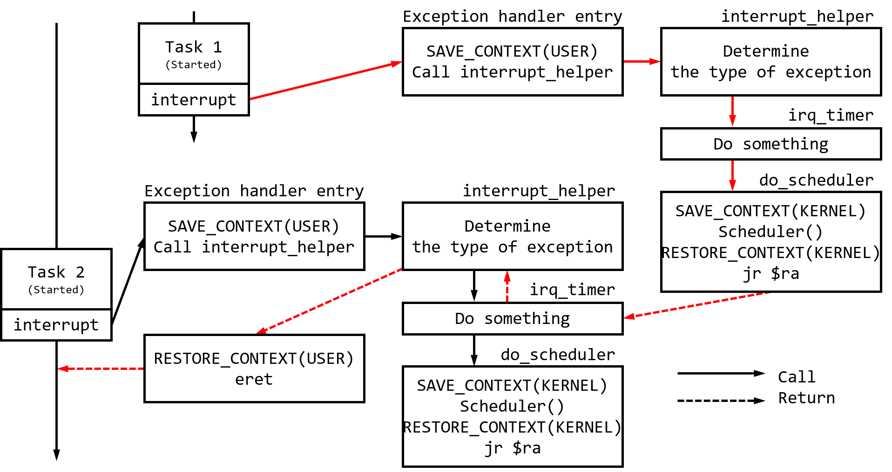
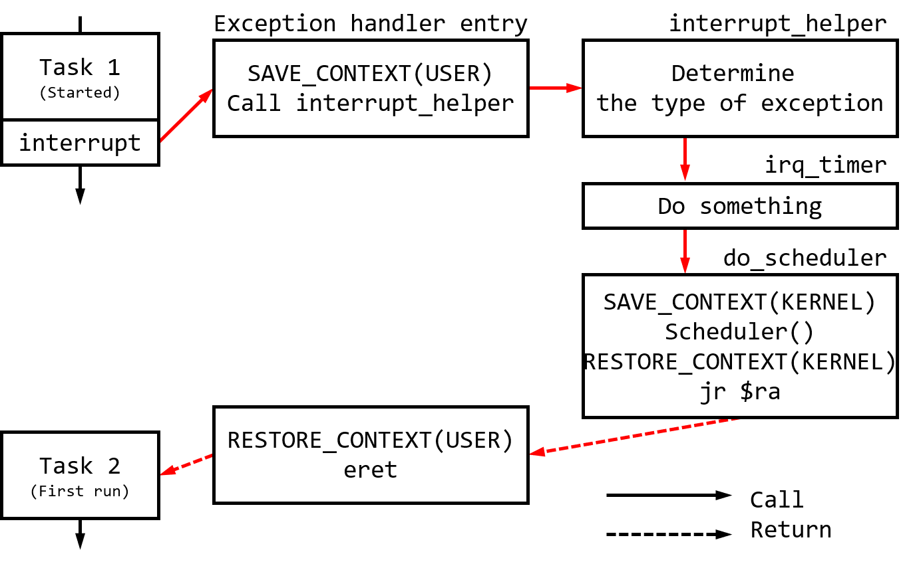
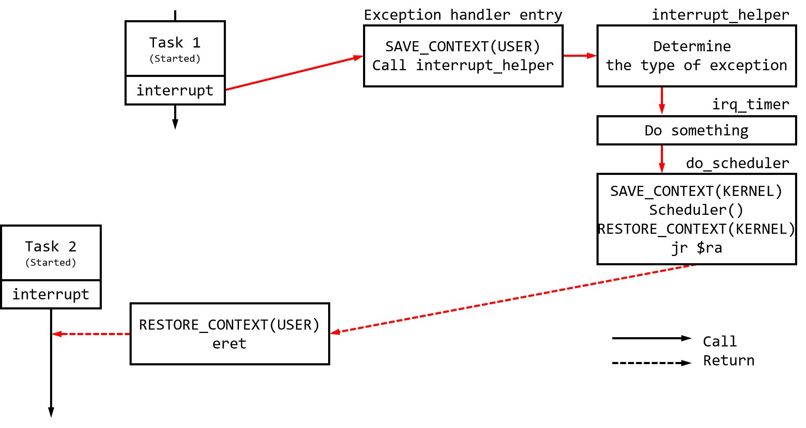
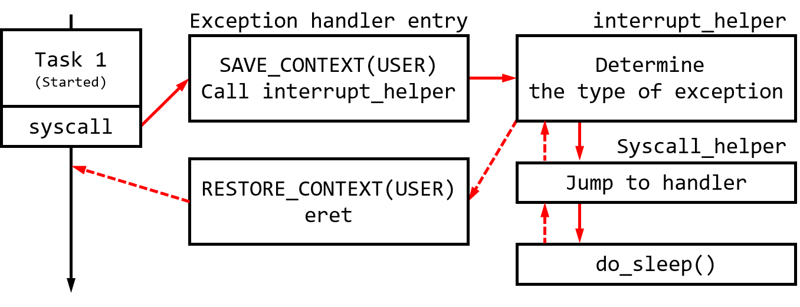

# Project 2 A Simple Kernel 设计文档（Part II）
> 中国科学院大学 徐泽凡 2018K8009929037

## 时钟中断、系统调用与 blocking sleep 设计流程
### (1) 时钟中断处理的流程
对于切换到另一个正在运行的程序，时间中断的处理流程如下图所示，图中红色线条表示程序执行过程。当 `do_scheduler` 函数完成内核态进程的切换后，程序沿此前中断处理时产生的调用栈逐层返回。



对于切换到另一个初次启动的程序，时间中断的处理流程如下图所示，图中红色线条表示程序执行过程。初次启动的进程没有经历过中断处理流程，不存在调用栈。我们需要通过设计其初始化的上下文，构造一个虚拟的调用栈。

<!--  -->


构造虚拟的调用栈的做法，避免了在 `do_scheduler` 函数中添加新的判断内容，使得中断处理流程更加清晰。

### (2) 唤醒 sleep 任务的时机

唤醒 sleep 任务的工作在 `scheduler` 中完成。进入 `scheduler` 调度程序后，首先调用 `check_sleepping()` 过程检查是否由需要唤醒的进程，而后再根据调度算法选择下一个执行的进程。

### (3) 时钟中断与系统调用处理流程的对比

系统调用在异常处理流程的开始与结尾相同，仅中间处理函数部分不同，同时也不涉及进程之间的切换。系统调用（以 `sleep` 为例）的处理流程如下图所示。



### (4) 设计、实现、调试过程中遇到的问题和得到的经验
在实现 Part II 要求的功能之前，我对比阅读了 RISC-V 版本的任务书和代码框架。经过对比，我个人认为 RISC-V 将上下文存储在栈而不是 PCB 中的设计，会更方便用户栈和内核栈的切换。因此，我重新编写了 Part I 关于进程切换的一部分代码。

我还借鉴了 RISC-V 的设计，将判断异常类型的工作放在 C 语言中，更方便编码。但随后意识到，这样处理可能会导致性能的下降。在之后的实验中有可能会将这部分代码重新编写，改回用汇编实现。

## 基于优先级的调度器设计
### (1) 调度策略设计
我实现的调度策略较为简单粗暴：
* 在初始化时，根据 `task_info` 给每个进程设定优先级。优先级为整数，数值越大优先级越高。
* 在时间中断时，记录每个进程的最后运行时间（以秒计）。
* 在调度时，计算进程优先级和其等待时间，从就绪队列中找到优先级与等待时间之和最大的进程，切换到这个进程执行。

### (2) 测试用例
在测试时，启动两个打印飞机的程序，设置不同的优先级、不同的打印位置。

运行过程中，可以明显的看到，优先级高的进程画出的飞机飞得快，优先级低的则飞得慢。

### (3) 问题与经验
由于等待时间以秒计，太过粗略，导致在测试时，优先级低的进程运行的非常缓慢。对于这一点，可以将以秒计的等待时间更换为以毫秒计或以处理器时钟计的等待时间，这样有助于缩小不同优先级之间执行时间的差别。

## Context-Switch 开销测量的设计思路
上下文切换过程的开销即为 `do_scheduler` 函数的开销。

一个比较简单的想法即是在调用 `do_scheduler` 函数的前后分别获取当前时间，然后作差。尽管 `do_scheduler` 函数的前后存在进程的切换，但这个切换并不影响前后记录时间语句的顺序运行。

在获取 `do_scheduler` 函数执行完成时的时间戳后，并不能立刻将结果输出。立刻输出结果会导致 `printk` 占用大量的时间，在完成时钟中断处理后立刻产生了下一个中断。对此，我们可以新增一个单独的进程，读取结果并将之输出到屏幕上。需要注意的是，求差的过程必须在获取时间戳后立刻进行，以保证原子性。

## 关键函数功能
### 例外处理入口以及例外返回的汇编程序
这部分程序在 `arch/mips/kernel/entry.S` 中。
```MIPS
NESTED(exception_handler_entry, 0, $ra)
exception_handler_begin:
    # switch to kernel stack & save user context
    sd      $sp, OFFSET_USER_SP($k0)
    ld      $sp, OFFSET_KERNEL_SP($k0)
    SAVE_CONTEXT

    # set return address to exception_return
    dla     $ra, exception_return
    # prepare argvs for interrupt_helper
    move    $a0, $sp            # param: regs
    mfc0    $a1, CP0_STATUS     # param: status
    mfc0    $a2, CP0_CAUSE      # param: cause
    # call interrupt_helper
    dla     $k1, interrupt_helper
    jr      $k1

exception_handler_end:
END(exception_handler_entry)


NESTED(exception_return, 0, $ra)
    # retore user context & switch to user stack
    RESTORE_CONTEXT
    sd      $sp, OFFSET_KERNEL_SP($k0)
    ld      $sp, OFFSET_USER_SP($k0)

    # exception return
    eret
END(exception_return)
```
* 入口部分需要拷贝到 MIPS 架构指定的地址，这导致不能通过 `j` 指令局部跳转到 `interrupt_helper` 函数，必须先将地址加载到寄存器，然后再跳转。
* 入口部分修改了调用 `interrupt_helper` 时的返回地址，指定返回到 `exception_return`。

### `interrupt_helper` 函数
这部分程序在 `kernel/irq/irq.c`。
```c
void interrupt_helper(regs_context_t * regs, uint32_t status, uint32_t cause)
{
    exccode_t exccode = (cause & CAUSE_EXCCODE) >> 2;
    if (exccode == SYS)                                 // syscall
    {
        system_call_helper(regs->regs[2], regs->regs[4], regs->regs[5], regs->regs[6]);
        regs->epc += 4;
    }
    else if (exccode == INT && (cause & CAUSE_IP7))     // time interrupt
    {
        irq_timer();
    }
    else
    {
        printk("> [OTHER] exccode: %d\n\r", exccode);
        other_exception_handler(regs, status, cause);
    }
}
```
* 这部分用于根据 CP0 寄存器的信息，选择对应的处理程序。
* 这部分内容采用 C 程序编写，牺牲了部分性能，但编码难度较低。

### `irq_timer` 函数
这部分程序在 `kernel/irq/irq.c`。
```c
static void irq_timer()
{
    screen_reflush();

    /* increase global time counter */
    update_time_elapsed();

    /* reset timer register */
    reset_timer(TIMER_INTERVAL);

    current_running->last_run = get_timer();

    /* sched.c to do scheduler */
    time_before = get_cp0_count();

    do_scheduler();

    time_after = get_cp0_count();
    used_time = time_after - time_before;
}
```
* 在时间中断时，需要刷新屏幕、同步时间、更新进程运行的最后时间，并记录 `do_scheduler` 前后的时间戳。

### `update_time_elapsed` 函数
这部分程序在 `kernel/sched/time.c`。
```c
void update_time_elapsed() {
    uint32_t current = get_cp0_count();

    if (current > last_cp0_count)
    {
        time_elapsed = time_elapsed + current - last_cp0_count;
    }
    else
    {
        time_elapsed = time_elapsed + 0xffffffff + current - last_cp0_count;
    }

    last_cp0_count = current;
}
```
* 为了保证记录时间的准确性，且避免 CP0 count 寄存器溢出导致的各类问题，编写了这个程序用于同步时间。
* 函数根据上次同步时间与当前时间的差值，更新 `time_elapsed`，并单独处理 CP0 count 寄存器溢出时的情况。

### `scheduler` 函数
这部分程序在 `kernel/sched/sched.c`。
```c
void scheduler(void)
{
    check_sleeping();

    // handle current running task
    if (current_running->pid && current_running->status == TASK_RUNNING)
    {
        current_running->status = TASK_READY;
        queue_push(&ready_queue, current_running);
        current_running->in_queue = &ready_queue;
    }
    pcb_t * next_running;
    uint64_t max_priority = 0;
    uint64_t cur_time = get_timer();
    
    for (pcb_t * item = ready_queue.head; item; item = item->next)
    {
        int act_priority = item->priority + cur_time - item->last_run;
        if (act_priority > max_priority) {
            max_priority = act_priority;
            next_running = item;
        }
    }

    // switch
    queue_remove(&ready_queue, next_running);
    current_running = next_running;
    current_running->status = TASK_RUNNING;
    current_running->in_queue = NULL;

}
```
* 这部分程序实现了简单的优先级调度，具体调度算法在上文中已经介绍。

## 致谢
感谢在 Design Review 时与我交流的老师，与他的交流让我受益匪浅。

感谢在实验过程中与我交流的各位同学。